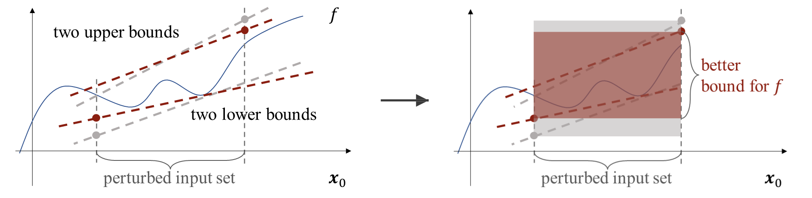

# MpBP: Verifying Robustness of Neural Networks with Multi-path Bound Propagation



Given an input region (often infinite perturbed input set) and a neural network *f*, 
*bound propagation* methods propagate the input region along the
neural network to compute a bound function for each neuron,
thus the output neuron *f*.
The provable bounds of *f*
are then used to determine whether a misclassification exists in
this given input region.

MpBP (**M**ulti**p**ath **B**ound **P**ropagaiton) extends classical bound propagation
methods with multiple *propagation paths*.
Multiple propagation paths provides multiple pairs of bounds for a DNN *f*
(see the figure above).
MpBP is based on the widely-used
PyTorch machine learning framework, hence providing efficient
parallel verification on GPUs.

A video demonstration is available at https://youtu.be/3KyPMuPpfR8.

## Installation

According to our experience, MpBP can work properly in Python 3.7+ and PyTorch 1.8+. 
Note that the available PyTorch version may depend on you CUDA version, 
which is often fixed in a GPU environment. 
So we highly recommend users to see the [PyTorch Get Start](https://pytorch.org/get-started/locally/) 
page to match their system environment. 

[Miniconda](https://docs.conda.io/en/latest/miniconda.html) is also recommended for
Python packages management. Once the Python and PyTorch is deployed, 
users can install other requirement packages of MpBP via:

```bash
cd ./mpbp
pip install requirements.txt
```

Besides `torch`, MpBP only requires `numpy`, `packaging`, and `appdirs`.

## Usage

We provide a command line interface to MpBP, whose detailed usage is at Choice 1.
For more flexible usage, scripts that invoke MpBP library are recommended, see Choice 2.

### Choice 1. Command Line 

```bash
$ python mpbp.py  --net <filename> --spec <spec file> --path <path number> \
                --bp <verification method> --verbose <output info>
```

where the meaning of each parameter is as follows:

* `<filename>`: the DNN model to be verified;
* `<spec file>`: the file containing the expected specification to be verified, whose details are explained later;
* `<path number>`: the number of propagation paths used for verification;
* `<verification method>`: the bound propagation method used for verification. It can be `fbp`, `fbbp`, `bbp`, or `ibp`;
* `<output info>`: the verification results returned. It can be `True`, which outputs the reachable region, the
    verification result (verified/unknown) and verification time for
    each verification problem, or `False` (the default) that outputs only a summary of verification results.

An example spec file `specification.py` provided in MpBP project looks like this:

```python
# the dataset from which the input x_0 is chosen. It can be 'MNIST', 'CIFAR10',
# or a path to a user-defined dataset.
dataset = 'MNIST'
# the index of the input x_0 in the dataset.
x_0 = 0
# the number of problems for verification. 
# If it is set to b, then the first b inputs in the dataset will be 
# individually used as x_0 for verification. 
# It will overwrite the x_0 field when b>0.
batch = -1
# the perturbation threshold.
delta = 0.01
# the type of L_p-norm. It can be 'inf', 1, or 2.
norm = 'inf'
# the unsafe label(s). It can be 'untarget' that sets all incorrect labels as unsafe.
unsafe = 'untarget'
```

Users can enter to the `demonstration/` folder and run:

```bash
$ python mpbp.py  --net ./mnist_ffnn.pth --spec ./specification.py --path 4 --bp bbp --verbose True
```
to see an output example. The command line usage and the features of MpBP is also presented in our demonstration video https://youtu.be/3KyPMuPpfR8.

### Choice 2. Scripts

We provide some template of the scripts in the `example/vision/` folder.

A quick start of these scripts is as follows:

```python
from multipath_bp import BoundedModule, BoundedTensor, PerturbationLpNorm

# Step 1. load model.
class MyModel(nn.Module):
    def forward(self, x):
        # Define your network model here.

model = MyModel()
my_input = load_inputs()
# Step 2. warp the model with MpBP.
model = BoundedModule(model, my_input)
# Step 3. define perturbation.
ptb = PerturbationLpNorm(norm=np.inf, eps = 0.01)
# Step 4. make the input a BoundedTensor with the perturbation.
my_input = BoundedTensor(my_input, ptb)
# Step 5. Compute the output bounds with a MpBP method.
lb, ub = model.compute_bounds(x=my_input, method='bbp')
```
For the complete code and other detailed usage, checkout the `example/vision/` folder please.

## Thanks

MpBP is implemented on the [auto_LiRPA](https://github.com/KaidiXu/auto_LiRPA). We express many thanks here to its authors (see LICENSE)
for providing such an outstanding tool.
